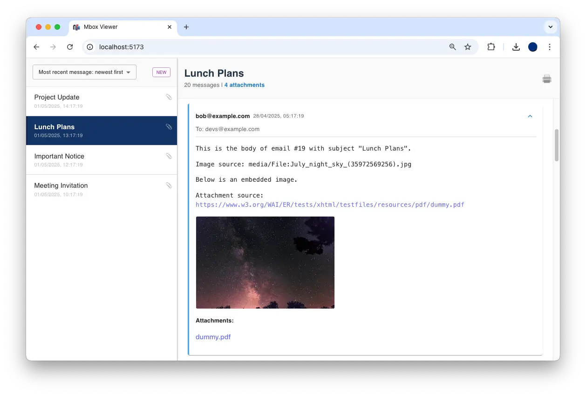

# 📬 Mbox Viewer

A simple web app for viewing and navigating the contents of .mbox or .zip (containing .mbox files) email archives. Built for privacy, all parsing is done in memory and no email content or attachments are stored on disk.

## Features & Requirements

- **First Use State:**
  - Full-viewport drag-and-drop or file picker for .mbox or .zip upload.
  - 30MB file size limit enforced on upload.
- **Processing:**
  - Server parses the .mbox file (directly or extracted from .zip) using `mailparser`.
  - All parsing is in-memory; no data is written to disk.
  - Emails are grouped by subject, ignoring prefixes like `Re:`, `Fw:`, `Fwd:`, and `Automatic reply:` (recursively).
  - Special handling for Google Calendar notifications: if an email has an attachment named `invite.ics`, the subject is normalized by removing the prefix up to the first `:` and the last string within parentheses.
  - JSON response includes:
    - Subject
    - Sender
    - Recipients (to, cc, bcc)
    - Body (escaped HTML, including embedded attachments)
    - All attachments (with mime-type, filename, and base64-encoded content)
- **Client UI:**
  - Left column lists all subject groups, ordered by the most recent email in each group.
  - Paperclip icon indicates threads with downloadable attachments.
  - Clicking a subject shows the thread in the right panel.
  - Each email in the thread is shown in a card, with sender, date, recipients, body, and downloadable attachments.
  - Cards can be collapsed/expanded to show only sender and date.
  - Responsive, desktop-focused UI using Material UI (MUI).
  - The attachment count is a clickable link; clicking it expands a list of all attachments in the thread, each with a download link and an envelope emoji (✉️) that scrolls to the corresponding email card.
  - A small print button (🖨️) in the thread header allows printing the current thread view.
  - Print/export to PDF hides the left column and expands the right column for clean output.
  - **Optional:** Users can enable caching to store parsed threads in browser storage (IndexedDB) for large files. If enabled, the app will load cached threads on refresh and skip the upload UI.
  - **Sorting Options:** Users can sort threads by:
    - Most recent message: newest first
    - Most recent message: oldest first
    - First message: newest first
    - First message: oldest first

## Technical Details

- **Backend:**

  - Node.js + Express (in `server/`)
  - Uses `mailparser` for robust .mbox parsing
  - Supports .mbox files directly or .zip files containing .mbox files
  - No use of abandonware (e.g., `mbox` npm package)
  - CORS enabled for local development
  - 30MB upload limit enforced via `multer`
  - All parsing and grouping logic is in-memory

- **Frontend:**
  - React + Vite + TypeScript (in `client/`)
  - Material UI (MUI) for layout and components
  - Drag-and-drop and file picker for .mbox or .zip upload
  - Threaded email navigation with attachment download
  - Print styles for PDF export
  - Uses IndexedDB (via `idb`) for optional large-data caching

## Getting Started

### Prerequisites

- Node.js (v18+ recommended)
- npm

### Setup

1. **Clone the repository:**

   ```sh
   git clone https://github.com/chrsptn/mbox-viewer.git
   cd mbox-viewer
   ```

2. **Install all dependencies (root, server, client) with one command:**

   ```sh
   npm run install-all
   ```

3. **Start both backend and frontend together:**

   ```sh
   npm run dev
   ```

   This will run both the Express backend and the Vite React frontend concurrently.

4. **Open the app:**
   - Visit [http://localhost:5173](http://localhost:5173) in your browser.

### Usage

- Drag and drop a `.mbox` or `.zip` file (max 30MB) or use the file picker.
- Wait for the server to process and return the parsed emails.
- Browse threads in the left column; view and download attachments in the right panel.
- Collapse/expand individual emails for easier navigation.
- Print or export to PDF for a clean, single-column output.
- **Optional:** Enable "Cache emails in browser storage" before uploading to store parsed threads in IndexedDB. On refresh, the app will load cached threads and skip the upload UI.

## Screenshot

Below is a screenshot of the Mbox Viewer application in action:



## Example/Test Mbox Files

Sample mbox files for testing are provided in the `example/` directory:

- `example/sample.mbox`: A sample mbox file containing 100 emails with a variety of subjects.
- `example/sample.mbox.zip`: A zip archive containing the same sample mbox file, for testing zip upload support.

### Creating Your Own Sample Mbox File

You can generate a sample mbox file using the provided script:

```sh
cd example
node generate.js
```

This will create a `sample.mbox` file with 100 emails and a `sample.mbox.zip` archive. You can use these files to test the application's upload and parsing features.

### Using the Example Files

- On the app's upload screen, drag and drop `sample.mbox` or `sample.mbox.zip`, or use the file picker to select one of these files.
- The app will process and display the emails for navigation and testing.

## Privacy & Security

- All parsing is performed in memory only; no email content or attachments are written to disk on the server or client.
- No persistent storage or database is used on the backend.
- Optional browser caching (IndexedDB) is available, but only if the user enables it before upload. Cached data remains local to the user's browser and is never transmitted elsewhere.
- No email data is ever sent to third-party services; all processing is local to your environment.
- Intended for internal/private use only. Use with sensitive data at your own discretion.

## Credits

- [**mailparser**](https://github.com/nodemailer/mailparser): Used on the backend to robustly parse .mbox files and extract email content, metadata, and attachments.
- [**multer**](https://github.com/expressjs/multer): Handles multipart form uploads (file uploads) in the Express backend, enforcing the 30MB file size limit and providing easy access to uploaded files in memory.
- [**concurrently**](https://github.com/open-cli-tools/concurrently): Allows running both the backend and frontend servers with a single command for streamlined development.
- [**Material UI (MUI)**](https://mui.com/): Provides a modern, accessible, and responsive component library for building the desktop-focused user interface.
- [**idb**](https://github.com/jakearchibald/idb): A small library for IndexedDB, used to cache large parsed email data in the browser.
- [**adm-zip**](https://github.com/cthackers/adm-zip): Used on the backend to extract .mbox files from uploaded .zip archives, enabling support for zipped email exports.
- [**GitHub Copilot**](https://github.com/features/copilot): Assisted in vibe-coding this awesome and useful tool, helping with code, design, and documentation throughout the project.

## Model

This project was developed with the assistance of GitHub Copilot, powered by OpenAI's GPT-4 model. Copilot provided code suggestions, design ideas, and documentation support throughout the development process.

## License

This project is licensed under the MIT License. See the [LICENSE](./LICENSE) file for details.

## To Do:

- Pre-upload options such as (all on by default):
  - Normalise subject (removing reply and forward prefixes)
  - Normalise Google Calendar notification (removing state change and calendar name)
  - Include inline attachments
  - Include downloadable attachments
- Export as JSON
- Better removal/collapsing of quoted thread emails
- ~~🖨️ button in thread view~~
- ~~List all included downloadable attachments~~
